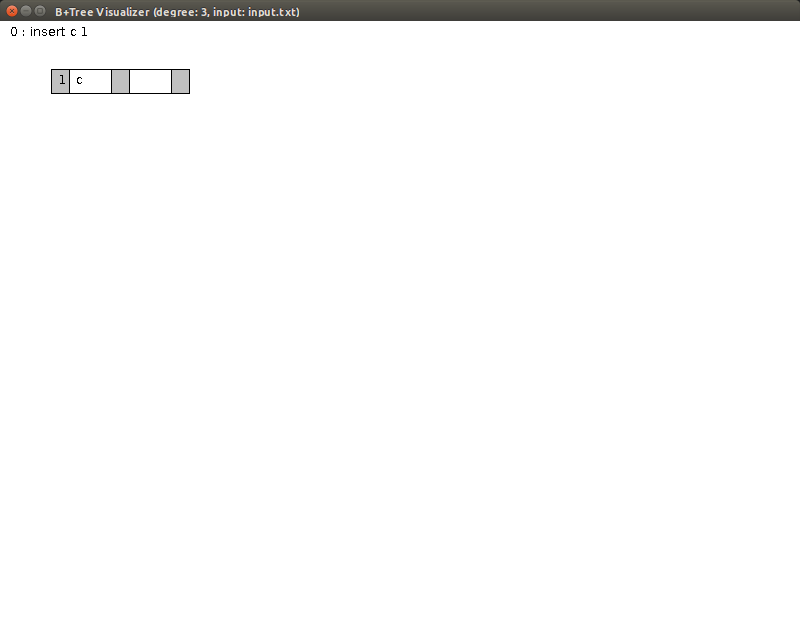
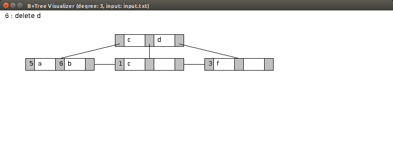
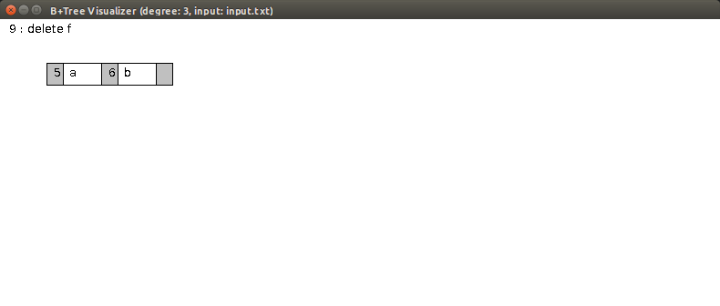

# Implementations of B+ tree for database systems
A java program that demonstrates how B+ trees running is implemented. This Java program illustrate the B+ tress structures. It could insert and delete key and pointers inside the B+ tree.

## Instruction for use
Download, import and run the project. This project is validated with Eclipse.

Command for inserting and deleting key and pointers are in input.txt, and the program will run the commands inside. After running the program, the figure showing B+ tree status will be shown in figures.

After inserting
insert c1

After inserting 
insert c 1
insert d 2
insert f 3
insert a 5
insert b 6
insert b 7

After deleting d
delete d

After deleting 
delete d
delete c
delete c
delete f

